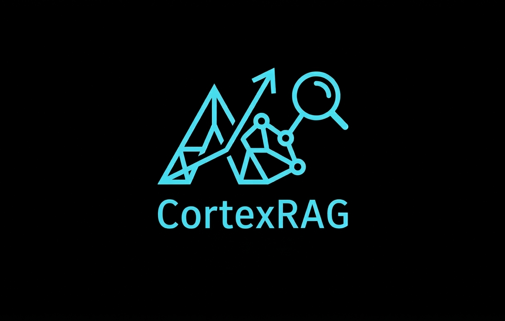

<div align="center">
  
  <h1>CortexRAG</h1>
  <p><i>Autonomous Multi-Agent Framework for Intelligent Research & RAG Generation</i></p>

  [](https://pypi.org/project/cortexrag/)
  [](https://www.python.org/downloads/)
  [](https://opensource.org/licenses/MIT)
</div>

---

## 💡 Overview

**CortexRAG** is a sophisticated engine designed for automated Deep Research and Knowledge Base construction. By leveraging **LangGraph** for resilient multi-agent state management and **LlamaIndex** for high-performance data indexing, CortexRAG orchestrates the entire lifecycle: from real-time web exploration to structured RAG deployment.

### Key Features:
- **Multi-Model Orchestration:** Seamlessly combine different LLMs for specialized tasks (e.g., fast models for search, reasoning models for synthesis).
- **Graph-Based Reasoning:** State-of-the-art agent coordination using directed acyclic graphs.
- **Autonomous Pipeline:** Automatic content cleaning, Markdown conversion, and vector storage.
- **Developer-Centric:** Built with clean architecture and **Dishka** Dependency Injection support.

---

## 🚀 Quick Start

### Installation

Install the package via `pip`:
```bash
pip install cortexrag
```
Or using `uv` for lightning-fast dependency management:
```bash
uv add cortexrag
```

### Usage Example

Get your research pipeline running with just a few lines of code:

```python
from cortexrag import Engine
from cortexrag.models import Llama, Gemini 

# 1. Initialize your AI Models
model_research = Llama()   # Optimized for extraction
model_synthesis = Gemini() # Optimized for deep reasoning

topic = "The impact of Machine Learning on modern medicine"

# 2. Configure the Engine
engine = Engine(
    topic=topic, 
    models=(model_research, model_synthesis)
)

# 3. Execute the Autonomous Research & Indexing
engine.build()
```

---

## 🏗 System Architecture

CortexRAG breaks down the complexity into clear, agentic phases:

1. **Research Phase**: Parallel web searching using DuckDuckGo or Crawl4AI.
2. **Processing Phase**: Noise removal and structured Markdown extraction.
3. **Indexing Phase**: Generating vector embeddings and persistent storage.
4. **Synthesis Phase**: Final knowledge distillation and response generation.

---

## 🛠 Development

To set up the environment for development:

1. Clone the repository:
   ```bash
   git clone https://github.com/Dlzxn/CortexRAG.git
   ```
2. Sync dependencies:
   ```bash
   uv sync
   ```

---

<div align="center">
  <p>Built for the future of Autonomous Intelligence.</p>
</div>
```